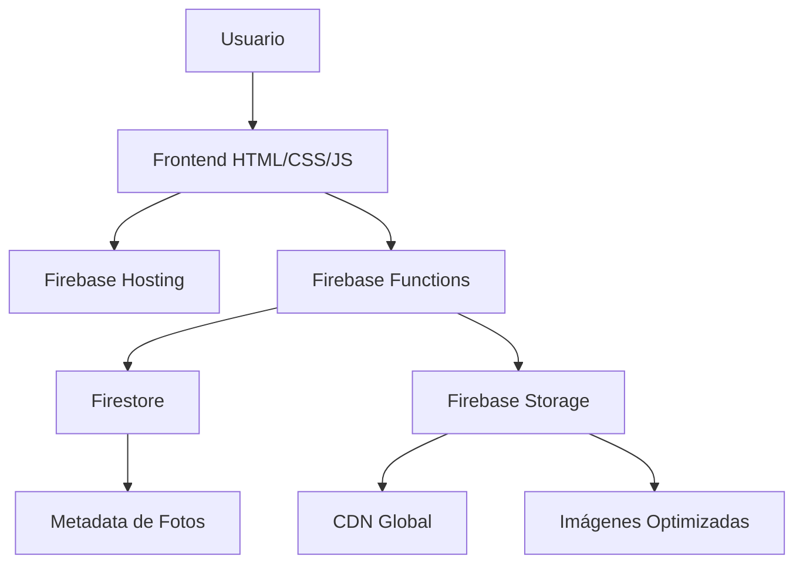

# 🎉 Momentos en Vivo

**Sistema Profesional de Captura Fotográfica en Tiempo Real para Eventos**

[](https://firebase.google.com/)
[](https://nodejs.org/)
[](https://developer.mozilla.org/en-US/docs/Web/JavaScript)
[](https://developer.mozilla.org/en-US/docs/Web/HTML)
[](https://developer.mozilla.org/en-US/docs/Web/CSS)

## 📋 Descripción

Momentos en Vivo es un sistema completo y profesional diseñado para capturar fotos en tiempo real durante eventos como bodas, fiestas corporativas, conferencias y celebraciones. El sistema permite a los invitados tomar fotos usando sus smartphones y compartirlas instantáneamente en una pantalla de proyección.

### ✨ Características Principales

- 📸 **Captura en Tiempo Real**: Los invitados toman fotos con sus smartphones
- 👮 **Moderación Inteligente**: Sistema automático y manual de aprobación de fotos
- 📺 **Proyección Automática**: Slideshow continuo con transiciones suaves
- 🎯 **Panel de Control**: Dashboard completo para gestión de eventos
- 🔒 **Sistema Seguro**: Autenticación robusta y aislamiento de datos
- 📱 **100% Móvil**: Compatible con todos los dispositivos
- 🎨 **Temas Personalizables**: Múltiples diseños para diferentes eventos
- ☁️ **Almacenamiento en la Nube**: Firebase Storage con CDN global

## 🚀 Demo en Vivo

**🌐 URL de Producción:** [https://momentos-en-vivo.web.app](https://momentos-en-vivo.web.app)

### 📋 Páginas Disponibles

| Página | URL | Descripción |
|--------|-----|-------------|
| 🏠 **Inicio** | `/` | Landing page con información del servicio |
| 🎮 **Demo Gratuita** | `/demo-dashboard.html` | Panel de control para probar el sistema |
| 📸 **Captura** | `/home.html?event=DEMO_ID` | Página para tomar fotos |
| 👮 **Moderación** | `/moderador.html?event=DEMO_ID` | Panel para aprobar/rechazar fotos |
| 📺 **Proyección** | `/proyeccion.html?event=DEMO_ID` | Pantalla de slideshow |
| 👤 **Cliente** | `/cliente-panel.html` | Panel para clientes premium |

## 🛠️ Tecnologías Utilizadas

### Backend
- **Firebase Functions**: API serverless con Node.js
- **Firebase Storage**: Almacenamiento de imágenes con CDN
- **Firestore**: Base de datos NoSQL para metadata
- **Firebase Hosting**: Hosting con SSL automático

### Frontend
- **HTML5/CSS3**: Interfaz moderna y responsive
- **JavaScript (ES6+)**: Lógica del cliente
- **Fetch API**: Comunicación con el backend
- **Canvas API**: Procesamiento de imágenes
- **WebRTC**: Acceso a cámara del dispositivo

### DevOps
- **Git**: Control de versiones
- **GitHub**: Repositorio remoto
- **Firebase CLI**: Despliegue automatizado
- **NPM**: Gestión de dependencias

## 📁 Estructura del Proyecto

```
momentos-en-vivo/
├── 📁 functions/              # Firebase Functions (Backend)
│   ├── index.js              # API principal
│   ├── package.json          # Dependencias backend
│   └── ...
├── 📁 public/                # Frontend (Hosting)
│   ├── index.html           # Página principal
│   ├── home.html            # Captura de fotos
│   ├── moderador.html       # Panel de moderación
│   ├── proyeccion.html      # Slideshow
│   ├── demo-dashboard.html  # Demo gratuita
│   └── assets/              # Recursos estáticos
├── 📁 netlify/               # Funciones Netlify (legacy)
├── 📁 uploads/               # Fotos locales (desarrollo)
├── 📁 approved/              # Fotos aprobadas (desarrollo)
├── .firebaserc              # Configuración Firebase
├── firebase.json            # Configuración proyecto
├── firestore.rules          # Reglas base de datos
├── storage.rules            # Reglas almacenamiento
├── .gitignore              # Archivos ignorados
└── README.md               # Esta documentación
```

## 🚀 Instalación y Configuración

### Prerrequisitos

- Node.js 18+
- Firebase CLI
- Cuenta de Firebase
- Git

### 1. Clonar el Repositorio

```bash
git clone https://github.com/romer79-create/momentos-en-vivo.git
cd momentos-en-vivo
```

### 2. Instalar Dependencias

```bash
# Dependencias del proyecto principal
npm install

# Dependencias de Firebase Functions
cd functions
npm install
cd ..
```

### 3. Configurar Firebase

```bash
# Iniciar sesión en Firebase
firebase login

# Configurar proyecto (reemplaza con tu project ID)
firebase use TU_PROJECT_ID

# Configurar API key para funciones
firebase functions:config:set api.key="TuClaveSuperSecreta"
```

### 4. Configurar Variables de Entorno

Crear archivo `.env.local`:
```bash
API_KEY=TuClaveSuperSecreta
CLOUDINARY_CLOUD_NAME=tu_cloud_name
CLOUDINARY_API_KEY=tu_api_key
CLOUDINARY_API_SECRET=tu_api_secret
PORT=3000
```

### 5. Desplegar

```bash
# Desplegar funciones y hosting
firebase deploy

# Solo hosting
firebase deploy --only hosting

# Solo funciones
firebase deploy --only functions
```

## 🎯 Uso del Sistema

### Para Usuarios Finales

1. **Acceder a la Demo**: Visitar la URL principal y registrarse
2. **Capturar Fotos**: Usar el enlace de captura en cualquier dispositivo
3. **Ver Resultados**: Las fotos aparecen automáticamente en la proyección

### Para Moderadores

1. **Acceder al Panel**: Usar el enlace de moderación
2. **Aprobar/Rechazar**: Revisar fotos pendientes
3. **Gestionar Evento**: Controlar el flujo del evento

### Para Administradores

1. **Panel de Cliente**: Gestionar múltiples eventos
2. **Estadísticas**: Ver métricas de uso
3. **Configuración**: Personalizar temas y opciones

## 🔧 API Endpoints

### Funciones Firebase

| Endpoint | Método | Descripción |
|----------|--------|-------------|
| `/upload` | POST | Subir foto con FormData |
| `/upload-base64` | POST | Subir foto en base64 |
| `/get-photos` | GET | Obtener fotos pendientes |
| `/get-approved-photos` | GET | Obtener fotos aprobadas |
| `/approve-photo` | POST | Aprobar foto |
| `/reject-photo` | POST | Rechazar foto |
| `/get-demo-photos` | GET | Fotos para demo |
| `/social-share` | GET | Compartir en redes |

### Autenticación

Todas las APIs requieren header:
```javascript
headers: {
  'x-api-key': 'TuClaveSuperSecreta',
  'Content-Type': 'application/json'
}
```

## 🎨 Temas Disponibles

- `modern-blue` (predeterminado)
- `romantic-pink`
- `corporate-gray`
- `party-neon`
- `nature-green`
- `sunset-orange`

**Uso:** `?theme=nombre-del-tema`

## 🔒 Seguridad

- **API Keys**: Autenticación obligatoria
- **Aislamiento**: Cada demo tiene su propio eventId
- **Validación**: Verificación de tipos de archivo y tamaños
- **CORS**: Configurado para dominios específicos
- **Rate Limiting**: Protección contra abuso

## 📊 Arquitectura



## 🚀 Despliegue Automático

El proyecto incluye configuración completa para despliegue automático:

- **Firebase Hosting**: Frontend estático
- **Firebase Functions**: Backend serverless
- **CDN Global**: Optimización automática
- **SSL Automático**: Certificados Let's Encrypt

## 📈 Métricas y Monitoreo

- **Firebase Analytics**: Seguimiento de uso
- **Cloud Logging**: Logs detallados
- **Performance Monitoring**: Métricas de rendimiento
- **Error Reporting**: Detección automática de errores

## 🤝 Contribución

1. Fork el proyecto
2. Crear rama para feature (`git checkout -b feature/AmazingFeature`)
3. Commit cambios (`git commit -m 'Add some AmazingFeature'`)
4. Push a la rama (`git push origin feature/AmazingFeature`)
5. Abrir Pull Request

## 📝 Licencia

Este proyecto está bajo la Licencia MIT. Ver archivo `LICENSE` para más detalles.

## 📞 Contacto

**Jorge Romero Daniel**
- 📧 Email: romer79@gmail.com
- 📱 Celular: +54 376 410 5310
- 🌐 Web: [momentos-en-vivo.web.app](https://momentos-en-vivo.web.app)
- 💼 LinkedIn: [Masamune Code](https://linkedin.com/in/masamunecode)

## 🙏 Agradecimientos

- Firebase por la plataforma increíble
- Comunidad de desarrolladores
- Todos los testers y usuarios beta

---

**⭐ Si te gusta este proyecto, ¡dale una estrella en GitHub!**

**🎉 ¡Gracias por usar Momentos en Vivo!**